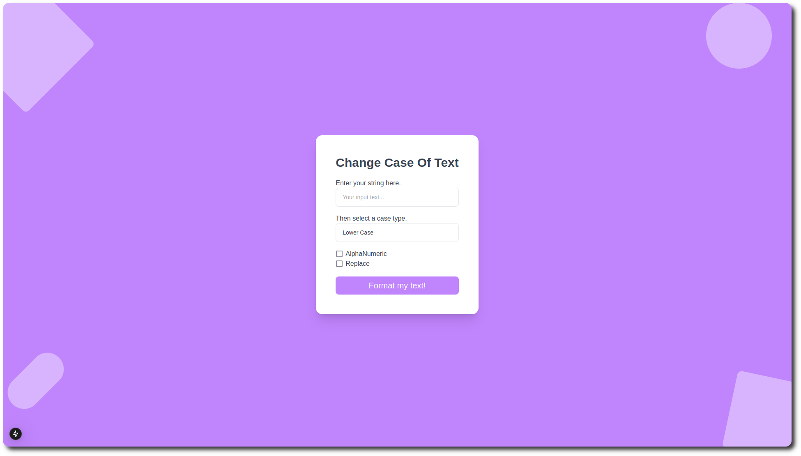
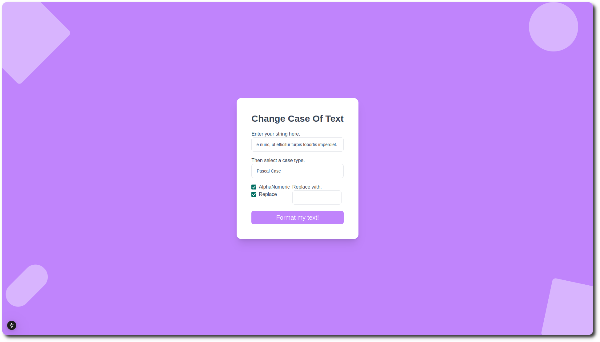
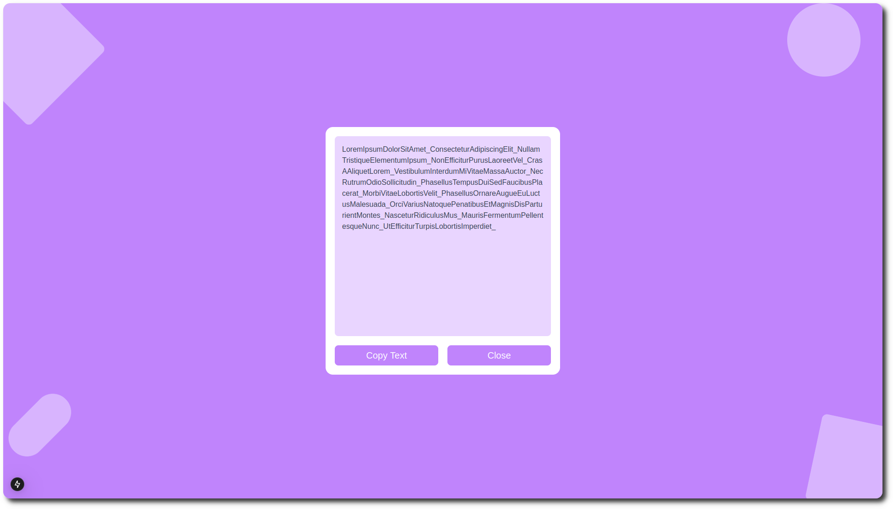

# NextJS Formik Yup Vitest Text Case Converter


A modern, user-friendly text case conversion tool built with Next.js and React. This application allows you to easily transform text between different case formats with additional formatting options.

## Features

- **Multiple Case Type Conversions:**
  - Lower Case
  - Upper Case
  - Camel Case
  - Pascal Case
  - Snake Case
  - Kebab Case
  - Title Case
  - Sentence Case
  - Train Case
  - Dot Case
  - Screaming Snake Case
  - Studly Caps

- **Additional Formatting Options:**
  - Alphanumeric filtering
  - Custom character replacement
  - Copy to clipboard functionality

- **User-Friendly Interface:**
  - Real-time validation
  - Toast notifications for errors
  - Result display in a popup modal

## Technologies Used

- Next.js
- React
- TypeScript
- Formik
- Yup
- Tailwind CSS
- Vitest





## Getting Started

1. Install dependencies:

```
  yarn
```

2. Run the development server:

```
  yarn dev
```
## Usage

- Enter your text in the input field

- Select your desired case type from the dropdown menu

- (Optional) Enable additional formatting options:

  - Check "Alphanumeric" to filter out non-alphanumeric characters
  - Check "Replace" to specify a custom replacement character

- Click "Format" to see the result

- Copy the converted text from the popup modal

## Testing

The project uses Vitest as its testing framework. Run the tests using:
```
  yarn test
  
  yarn test:ui
```
